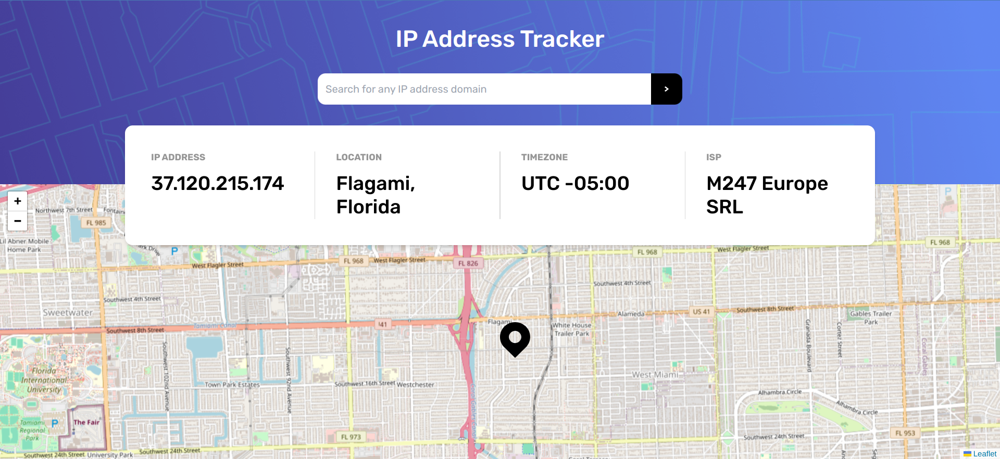

# Frontend Mentor - IP address tracker solution

This is a solution to the [IP address tracker challenge on Frontend Mentor](https://www.frontendmentor.io/challenges/ip-address-tracker-I8-0yYAH0). Frontend Mentor challenges help you improve your coding skills by building realistic projects. 

## Table of contents

- [Overview](#overview)
  - [The challenge](#the-challenge)
  - [Screenshot](#screenshot)
  - [Links](#links)
- [My process](#my-process)
  - [Built with](#built-with)
  - [Useful resources](#useful-resources)
- [Author](#author)

## Overview

### The challenge

Users should be able to:

- View the optimal layout for each page depending on their device's screen size
- See hover states for all interactive elements on the page
- See their own IP address on the map on the initial page load
- Search for any IP addresses or domains and see the key information and location

### Screenshot

### Links

- Solution URL: [https://github.com/carlosmca44/ip-address-tracker](https://github.com/carlosmca44/ip-address-tracker0  )
- Live Site URL: [https://ip-address-tracker-blond-rho.vercel.app/](https://ip-address-tracker-blond-rho.vercel.app/)

## My process

### Built with

- Semantic HTML5 markup
- Flexbox
- Mobile-first workflow
- [React](https://reactjs.org/) - JS library
- [Astro](https://astro.build/) - Web framework
- [Tailwind](https://tailwindcss.com/) - CSS framework
- [nanostores](https://github.com/nanostores/nanostores) - State manager

### Useful resources

- [Leaflet](https://leafletjs.com/) - is the leading open-source JavaScript library for mobile-friendly interactive maps.
- [React Leaflet](https://react-leaflet.js.org/) - React components for Leaflet maps.
- [IP Geolocation API](https://geo.ipify.org/) - Allows you to locate and identify website visitors by IP address.

## Author

- Website - [carlosmca44](https://github.com/carlosmca44/)
- Frontend Mentor - [@carlosmca44](https://www.frontendmentor.io/profile/carlosmca44)
- Twitter - [@Carlosmca44](https://www.twitter.com/@Carlosmca44)
